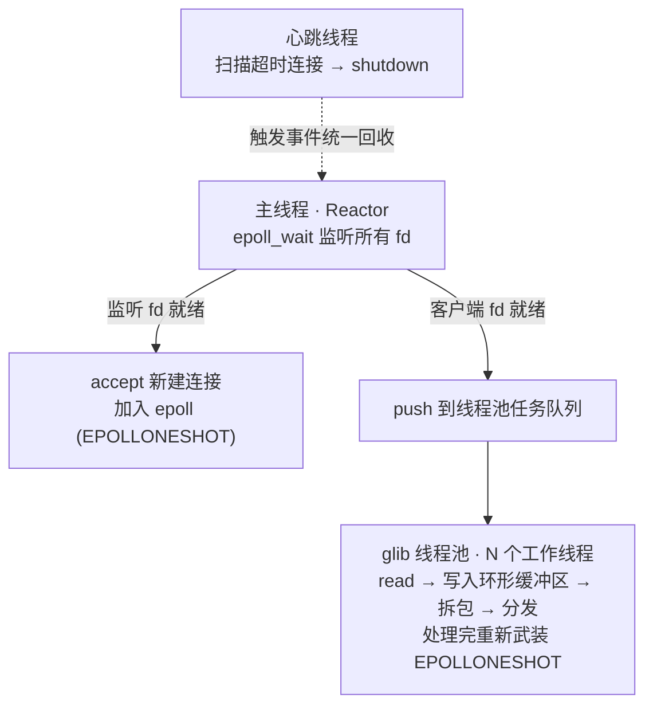

# TCP 多人聊天室

基于 Linux 的 C 语言高并发即时通信系统，独立完成服务端与客户端的设计、实现与测试。涵盖 **epoll I/O 多路复用、glib 线程池、自定义协议、环形缓冲区、守护进程、心跳检测、文件断点续传** 等后端核心知识点。

## ✨ 功能特性

- **群聊 / 私聊**：一对多广播与一对一定向消息
- **在线管理**：实时在线用户列表、上下线通知
- **心跳检测**：服务端自动剔除掉线 / 僵死连接
- **文件传输 + 断点续传**：传输中断后从断点继续，实测 `md5` 校验一致
- **守护进程**：服务端可后台常驻运行，日志写文件

## 🏗️ 架构设计

采用「epoll 主线程派发 + glib 线程池处理」的 **Reactor 模型**：



**关键设计点**

- **EPOLLONESHOT** 保证同一连接同一时刻只被一个线程处理，从根本上避免多线程并发读写导致的消息乱序，也是文件分块按序落盘的前提。
- **自定义协议**（定长包头 + 变长包体）配合**环形缓冲区**逐条拆包，彻底解决 TCP 粘包 / 拆包。
- 心跳超时用 `shutdown` 而非 `close`，由事件循环统一回收连接，规避并发释放竞争。

## 🛠️ 技术栈

`C` · `Linux` · `Socket` · `epoll` · `pthread` · `GLib (GThreadPool / GHashTable)` · `Makefile` · `GDB`

## 📦 项目结构

```
chatroom/
├── include/        # 头文件（协议、环形缓冲、用户管理、守护进程等）
├── src/            # 实现（server.c / client.c 及各模块）
├── files/          # 服务端文件存储目录
└── Makefile
```

## 🚀 编译与运行

```bash
# 依赖（Ubuntu/Debian）
sudo apt install build-essential libglib2.0-dev

# 编译
make

# 启动服务端（前台调试）
./bin/server -p 8888
# 或守护进程方式后台运行
./bin/server -p 8888 -d -l server.log

# 启动客户端（可开多个终端）
./bin/client 127.0.0.1 8888
```

## ⌨️ 客户端命令

| 命令 | 功能 |
|------|------|
| 直接输入文字 | 群聊 |
| `/to <用户名> <内容>` | 私聊 |
| `/who` | 查看在线用户 |
| `/file <文件路径>` | 上传文件（自动断点续传） |
| `/quit` | 退出 |

## 📄 License

MIT
